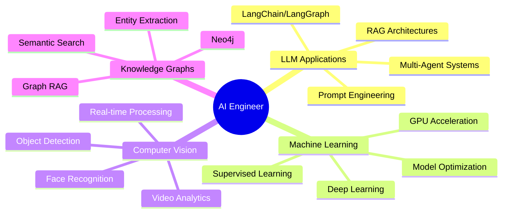

<div align="center">
  
# 👋 Hi, I'm Sahil Ranmbail - AI Engineer & ML Innovator


[](https://www.linkedin.com/in/sahil-ranmbail/)
[](mailto:sahil.ranmbail@gmail.com)

</div>

---

## 🚀 About Me

```python
class AIEngineer:
    def __init__(self):
        self.name = "Sahil"
        self.role = "AI Engineer"
        self.location = "Pakistan 🇵🇰"
        self.expertise = [
            "Large Language Models (LLMs)",
            "Multi-Agent AI Systems",
            "Graph RAG & Knowledge Graphs",
            "Computer Vision & Object Detection",
            "Natural Language Processing",
            "Machine Learning Operations"
        ]
        self.current_focus = "Building intelligent AI agents with CrewAI & LangGraph"
        
    def say_hi(self):
        print("Thanks for dropping by! Let's build something amazing together!")

me = AIEngineer()
me.say_hi()
```

🔭 **Currently Working On:** Advanced multi-agent AI systems and Graph RAG implementations  
🌱 **Learning:** Cutting-edge LLM architectures and agentic workflows  
💡 **Passionate About:** Democratizing AI and making intelligent systems accessible  
⚡ **Fun Fact:** I turn coffee into AI models ☕ → 🤖

---

## 🛠️ Tech Stack & Tools

### 🤖 AI/ML Frameworks


### 🧠 LLM & Agent Frameworks


### 🗄️ Databases & Vector Stores


### 👁️ Computer Vision


### 🌐 Web & Deployment


### ⚙️ Tools & Platforms


---

## 🌟 Featured Projects

<table>
<tr>
<td width="50%">

### 🤖 [CrewAI Multi-Agent Research Assistant](https://github.com/SahiL911999/CrewAI-Multi-Agent-Intelligent-Research-Assistant)
**Advanced AI-powered research assistant leveraging multi-agent collaboration**

🔹 Multi-agent orchestration with CrewAI  
🔹 Intelligent query routing & processing  
🔹 Comprehensive research synthesis  


</td>
<td width="50%">

### 🕸️ [Graph RAG Chat System](https://github.com/SahiL911999/Graph-RAG-Chat-System-with-Neo4j-Graph-Visualization-LangChain-Groq-Gradio-)
**AI-driven Graph RAG with Neo4j, LangChain & Gradio visualization**

🔹 Graph-based retrieval augmented generation  
🔹 Neo4j knowledge graph integration  
🔹 Interactive Gradio interface  


</td>
</tr>

<tr>
<td width="50%">

### 🚕 [NYC Taxi XGBoost GPU](https://github.com/SahiL911999/NYC-Taxi-XgBoost-leveraging-GPU)
**GPU-accelerated ML workflow for NYC taxi data analysis**

🔹 XGBoost with GPU acceleration  
🔹 cuDF & Pandas optimization  
🔹 RMM memory management  


</td>
<td width="50%">

### 💰 [AI Financial Reporting Workflow](https://github.com/SahiL911999/AI-Financial-Reporting-Workflow-LangGraph-SQLite-KPI-Analytics-)
**End-to-end AI financial platform with LangGraph & SQLite**

🔹 Natural language financial queries  
🔹 Automated KPI generation  
🔹 Secure authentication & analytics  


</td>
</tr>

<tr>
<td width="50%">

### 🎨 [Text-to-3D Generation](https://github.com/SahiL911999/Text-to-image-to-3D-Generation)
**Advanced AI workflow converting text to fully textured 3D models**

🔹 Text → Image → 3D pipeline  
🔹 ComfyUI framework integration  
🔹 Ready-to-use 3D assets  


</td>
<td width="50%">

### 👥 [YOLO People Counting System](https://github.com/SahiL911999/People-counting-entering-exiting-yolo)
**Real-time people tracking with YOLO v11 & movement analysis**

🔹 Ultralytics YOLO v11 detection  
🔹 Entry/exit tracking & analytics  
🔹 Movement direction analysis  


</td>
</tr>

<tr>
<td width="50%">

### 🔗 [Python to Neo4j Knowledge Graph](https://github.com/SahiL911999/Python-Repository-to-Neo4j-Knowledge-Graph-Pipeline)
**Complete automation: Repository Analysis → JSONL → Neo4j**

🔹 Automated repository analysis  
🔹 JSONL generation pipeline  
🔹 Neo4j knowledge graph loading  


</td>
<td width="50%">

### 😊 [Emotion Detection with MediaPipe](https://github.com/SahiL911999/Emotion-Detection-using-Google-Mediapipe-Facemesh)
**Real-time emotion detection using Google MediaPipe Face Mesh**

🔹 Google MediaPipe integration  
🔹 Real-time facial analysis  
🔹 Emotion classification pipeline  


</td>
</tr>
</table>

---

## 📊 GitHub Statistics

<div align="center">
  


</div>

---

## 🏆 GitHub Trophies

<div align="center">
  
[](https://github.com/ryo-ma/github-profile-trophy)

</div>

---

## 💼 Core Competencies

<div align="center">

| 🤖 AI/ML Engineering | 🧠 LLM & Agents | 🎯 Computer Vision | 📊 Data Science |
|:---:|:---:|:---:|:---:|
| Model Development | Multi-Agent Systems | Object Detection | Data Analysis |
| Feature Engineering | RAG Architectures | Face Recognition | Statistical Modeling |
| Model Optimization | Prompt Engineering | Image Processing | Predictive Analytics |
| MLOps & Deployment | Agent Orchestration | Video Analytics | Data Visualization |

</div>

---

## 🎯 Specializations



---

## 📈 Contribution Activity

<div align="center">


</div>

---

## 🌐 Connect With Me

<div align="center">

[](https://www.linkedin.com/in/sahil-ranmbail/)
[](mailto:sahil.ranmbail@gmail.com)

</div>

---

## 💡 Latest Blog Posts

<!-- BLOG-POST-LIST:START -->
- 🚀 Building Multi-Agent AI Systems with CrewAI
- 🕸️ Graph RAG: The Future of Retrieval Augmented Generation
- 🤖 Optimizing LLM Performance with LangGraph
- 👁️ Real-time Computer Vision with YOLO v11
- 📊 GPU-Accelerated Machine Learning with XGBoost
<!-- BLOG-POST-LIST:END -->

---

## 📫 Let's Collaborate!

I'm always interested in collaborating on innovative AI projects, especially in:

- 🤖 **Multi-Agent AI Systems** - Building intelligent agent orchestrations
- 🧠 **LLM Applications** - Creating practical LLM-powered solutions
- 🕸️ **Knowledge Graphs** - Developing semantic search and RAG systems
- 👁️ **Computer Vision** - Real-time detection and tracking systems
- 📊 **ML Engineering** - Scalable and production-ready ML pipelines

**Feel free to reach out if you want to discuss AI, collaborate on projects, or just chat about technology!**

---

<div align="center">

### 💭 Random Dev Quote


---


**⭐ From [SahiL911999](https://github.com/SahiL911999) | Building the Future with AI**

</div>
